# OQuaRE Metrics Comparison Report

**Ontology 1**: bfo-core  
**Ontology 2**: Lecture_improved  
**Comparison Date**: 2025-10-27 12:43:11

---

## Executive Summary

- **Metrics Improved**: 10 / 19
- **Metrics Degraded**: 6 / 19
- **Metrics Unchanged**: 3 / 19
- **Scaled Metrics Improved**: 4 / 19
- **Scaled Metrics Degraded**: 3 / 19
- **Characteristics Improved**: operability, compatibility, maintainability, transferability, functionalAdequacy
- **Characteristics Degraded**: None

---

## Characteristics Comparison

Comparison of the 6 main quality characteristics on a scale of 1 to 5.

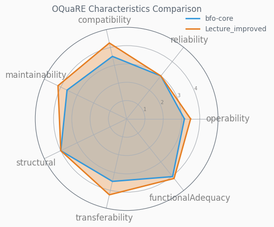

### Characteristics Summary Table

| Characteristic | bfo-core | Lecture_improved | Difference | Change % | Status |
|----------------|--------|----------------|------------|----------|--------|
| compatibility | 3.50 | 4.25 | +0.75 | +21.43% | ✅ |
| functionalAdequacy | 4.03 | 4.16 | +0.13 | +3.23% | ✅ |
| maintainability | 3.62 | 4.17 | +0.55 | +15.19% | ✅ |
| operability | 3.16 | 3.50 | +0.34 | +10.76% | ✅ |
| reliability | 3.00 | 3.00 | 0.00 | 0.00% | ➖ |
| structural | 4.00 | 4.00 | 0.00 | 0.00% | ➖ |
| transferability | 3.50 | 4.25 | +0.75 | +21.43% | ✅ |

---

## Metrics Comparison

### Scaled Metrics (1-5 Scale)

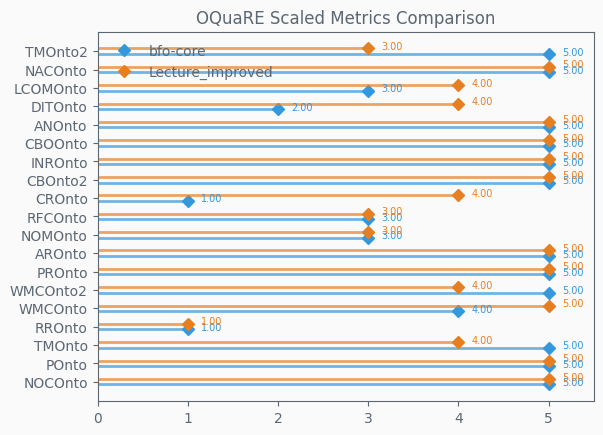

### Raw Metrics

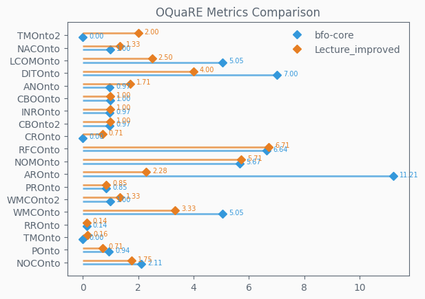

### Metrics Difference

Shows the change in scaled metric values (positive = improvement).

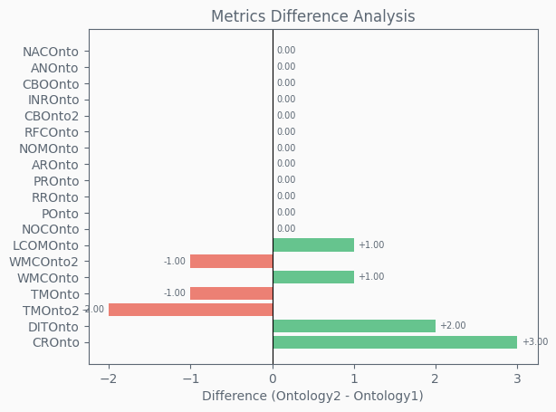

### Metrics Summary Table

| Metric | bfo-core | Lecture_improved | Difference | Change % | Status |
|--------|--------|----------------|------------|----------|--------|
| ANOnto | 5.00 | 5.00 | 0.00 | 0.00% | ➖ |
| AROnto | 5.00 | 5.00 | 0.00 | 0.00% | ➖ |
| CBOOnto | 5.00 | 5.00 | 0.00 | 0.00% | ➖ |
| CBOnto2 | 5.00 | 5.00 | 0.00 | 0.00% | ➖ |
| CROnto | 1.00 | 4.00 | +3.00 | +300.00% | ✅ |
| DITOnto | 2.00 | 4.00 | +2.00 | +100.00% | ✅ |
| INROnto | 5.00 | 5.00 | 0.00 | 0.00% | ➖ |
| LCOMOnto | 3.00 | 4.00 | +1.00 | +33.33% | ✅ |
| NACOnto | 5.00 | 5.00 | 0.00 | 0.00% | ➖ |
| NOCOnto | 5.00 | 5.00 | 0.00 | 0.00% | ➖ |
| NOMOnto | 3.00 | 3.00 | 0.00 | 0.00% | ➖ |
| POnto | 5.00 | 5.00 | 0.00 | 0.00% | ➖ |
| PROnto | 5.00 | 5.00 | 0.00 | 0.00% | ➖ |
| RFCOnto | 3.00 | 3.00 | 0.00 | 0.00% | ➖ |
| RROnto | 1.00 | 1.00 | 0.00 | 0.00% | ➖ |
| TMOnto | 5.00 | 4.00 | -1.00 | -20.00% | ❌ |
| TMOnto2 | 5.00 | 3.00 | -2.00 | -40.00% | ❌ |
| WMCOnto | 4.00 | 5.00 | +1.00 | +25.00% | ✅ |
| WMCOnto2 | 5.00 | 4.00 | -1.00 | -20.00% | ❌ |

---

## Subcharacteristics Comparison

Detailed comparison of subcharacteristics for each of the 6 main characteristics.

### compatibility
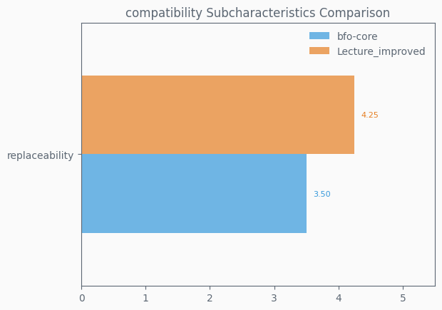

### functionalAdequacy
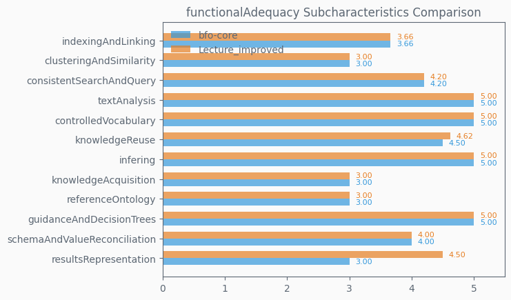

### maintainability
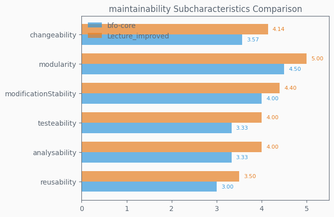

### operability
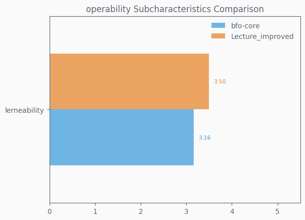

### reliability
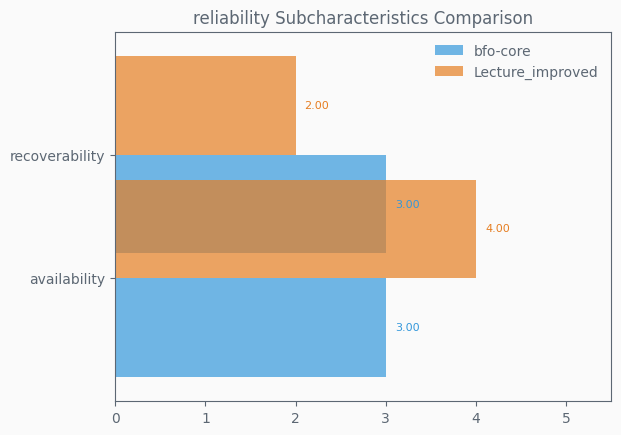

### structural
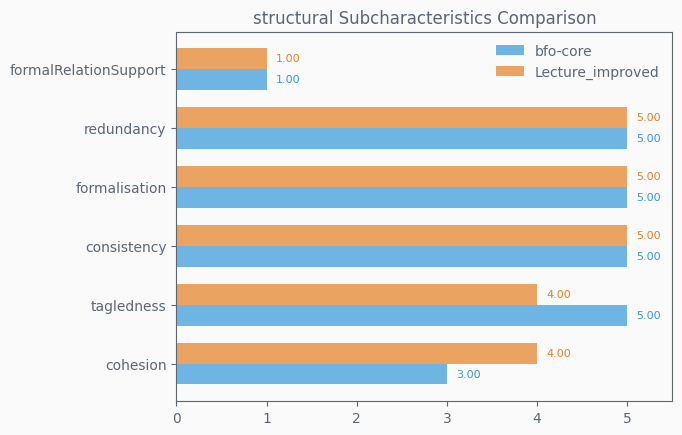

### transferability
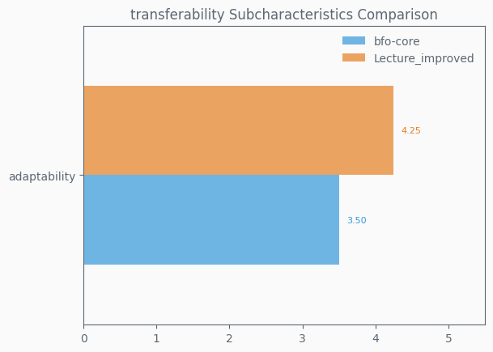

---

## Key Findings

### Top 5 Metric Improvements
1. **CROnto**: +3.00 (+300.00%)
2. **DITOnto**: +2.00 (+100.00%)
3. **WMCOnto**: +1.00 (+25.00%)
4. **LCOMOnto**: +1.00 (+33.33%)

### Top 5 Metric Degradations
1. **TMOnto2**: -2.00 (-40.00%)
2. **TMOnto**: -1.00 (-20.00%)
3. **WMCOnto2**: -1.00 (-20.00%)

---

*Generated by OQuaRE Metrics Comparison Tool*
