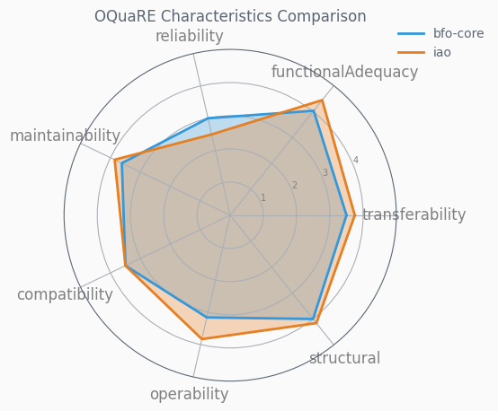
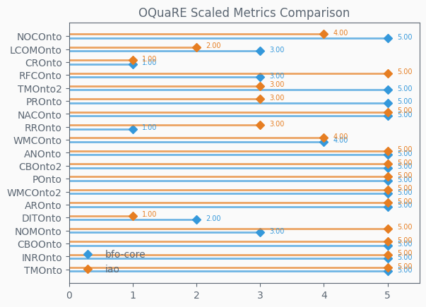
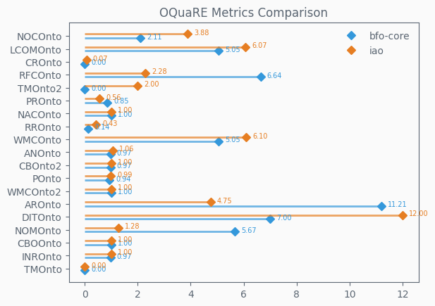
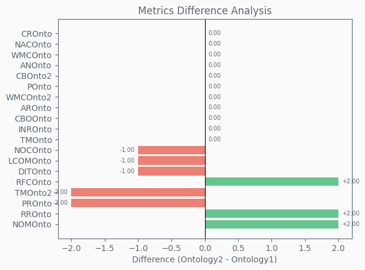
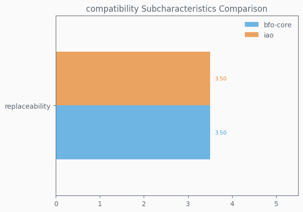
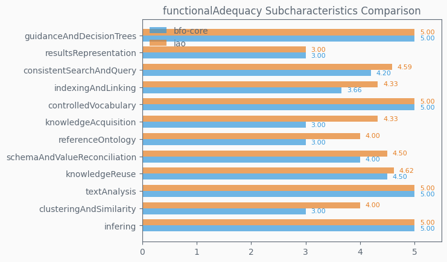
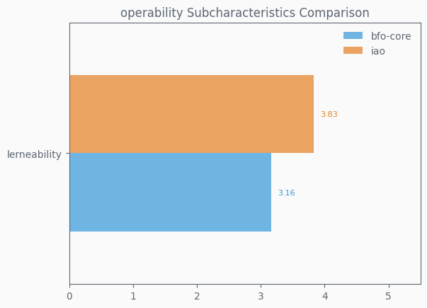
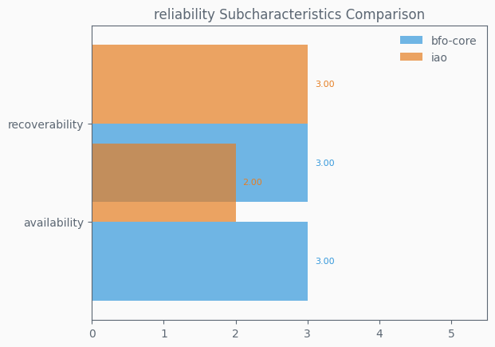
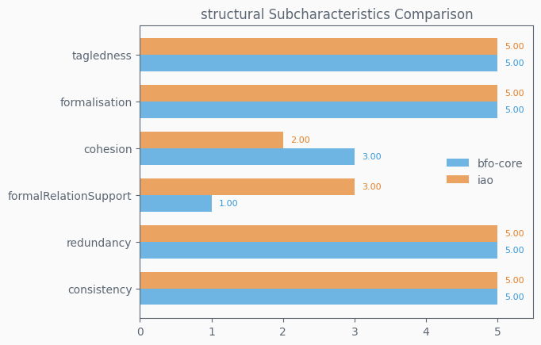
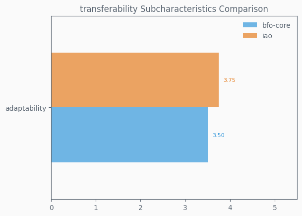

# OQuaRE Metrics Comparison Report

**Ontology 1**: bfo-core  
**Ontology 2**: iao  
**Comparison Date**: 2025-10-27 12:37:00

---

## Executive Summary

- **Metrics Improved**: 11 / 19
- **Metrics Degraded**: 4 / 19
- **Metrics Unchanged**: 4 / 19
- **Scaled Metrics Improved**: 3 / 19
- **Scaled Metrics Degraded**: 5 / 19
- **Characteristics Improved**: transferability, functionalAdequacy, maintainability, operability, structural
- **Characteristics Degraded**: reliability

---

## Characteristics Comparison

Comparison of the 6 main quality characteristics on a scale of 1 to 5.

### Characteristics Summary Table

| Characteristic | bfo-core | iao | Difference | Change % | Status |
|----------------|--------|---|------------|----------|--------|
| compatibility | 3.50 | 3.50 | 0.00 | 0.00% | ➖ |
| functionalAdequacy | 4.03 | 4.44 | +0.41 | +10.17% | ✅ |
| maintainability | 3.62 | 3.86 | +0.24 | +6.63% | ✅ |
| operability | 3.16 | 3.83 | +0.67 | +21.20% | ✅ |
| reliability | 3.00 | 2.50 | -0.50 | -16.67% | ❌ |
| structural | 4.00 | 4.16 | +0.16 | +4.00% | ✅ |
| transferability | 3.50 | 3.75 | +0.25 | +7.14% | ✅ |

---

## Metrics Comparison

### Scaled Metrics (1-5 Scale)

### Raw Metrics

### Metrics Difference

Shows the change in scaled metric values (positive = improvement).

### Metrics Summary Table

| Metric | bfo-core | iao | Difference | Change % | Status |
|--------|--------|---|------------|----------|--------|
| ANOnto | 5.00 | 5.00 | 0.00 | 0.00% | ➖ |
| AROnto | 5.00 | 5.00 | 0.00 | 0.00% | ➖ |
| CBOOnto | 5.00 | 5.00 | 0.00 | 0.00% | ➖ |
| CBOnto2 | 5.00 | 5.00 | 0.00 | 0.00% | ➖ |
| CROnto | 1.00 | 1.00 | 0.00 | 0.00% | ➖ |
| DITOnto | 2.00 | 1.00 | -1.00 | -50.00% | ❌ |
| INROnto | 5.00 | 5.00 | 0.00 | 0.00% | ➖ |
| LCOMOnto | 3.00 | 2.00 | -1.00 | -33.33% | ❌ |
| NACOnto | 5.00 | 5.00 | 0.00 | 0.00% | ➖ |
| NOCOnto | 5.00 | 4.00 | -1.00 | -20.00% | ❌ |
| NOMOnto | 3.00 | 5.00 | +2.00 | +66.67% | ✅ |
| POnto | 5.00 | 5.00 | 0.00 | 0.00% | ➖ |
| PROnto | 5.00 | 3.00 | -2.00 | -40.00% | ❌ |
| RFCOnto | 3.00 | 5.00 | +2.00 | +66.67% | ✅ |
| RROnto | 1.00 | 3.00 | +2.00 | +200.00% | ✅ |
| TMOnto | 5.00 | 5.00 | 0.00 | 0.00% | ➖ |
| TMOnto2 | 5.00 | 3.00 | -2.00 | -40.00% | ❌ |
| WMCOnto | 4.00 | 4.00 | 0.00 | 0.00% | ➖ |
| WMCOnto2 | 5.00 | 5.00 | 0.00 | 0.00% | ➖ |

---

## Subcharacteristics Comparison

Detailed comparison of subcharacteristics for each of the 6 main characteristics.

### compatibility

### functionalAdequacy

### maintainability

### operability

### reliability

### structural

### transferability

---

## Key Findings

### Top 5 Metric Improvements
1. **NOMOnto**: +2.00 (+66.67%)
2. **RROnto**: +2.00 (+200.00%)
3. **RFCOnto**: +2.00 (+66.67%)

### Top 5 Metric Degradations
1. **PROnto**: -2.00 (-40.00%)
2. **TMOnto2**: -2.00 (-40.00%)
3. **DITOnto**: -1.00 (-50.00%)
4. **LCOMOnto**: -1.00 (-33.33%)
5. **NOCOnto**: -1.00 (-20.00%)

---

*Generated by OQuaRE Metrics Comparison Tool*
