# OQuaRE Metrics Comparison Report

**Ontology 1**: lecture  
**Ontology 2**: bfo-core  
**Comparison Date**: 2025-10-27 12:28:33

---

## Executive Summary

- **Metrics Improved**: 13 / 19
- **Metrics Degraded**: 1 / 19
- **Metrics Unchanged**: 5 / 19
- **Scaled Metrics Improved**: 3 / 19
- **Scaled Metrics Degraded**: 6 / 19
- **Characteristics Improved**: None
- **Characteristics Degraded**: structural, compatibility, transferability, operability, maintainability, functionalAdequacy, reliability

---

## Characteristics Comparison

Comparison of the 6 main quality characteristics on a scale of 1 to 5.

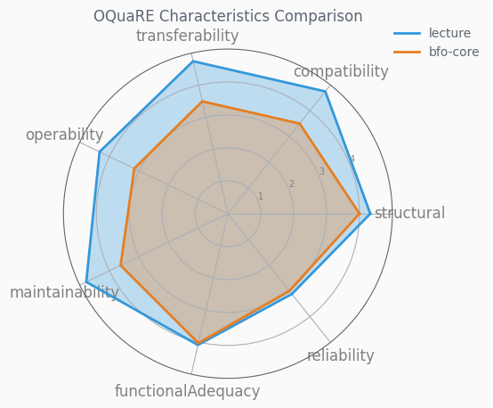

### Characteristics Summary Table

| Characteristic | lecture | bfo-core | Difference | Change % | Status |
|----------------|-------|--------|------------|----------|--------|
| compatibility | 4.75 | 3.50 | -1.25 | -26.32% | ❌ |
| functionalAdequacy | 4.09 | 4.03 | -0.06 | -1.47% | ❌ |
| maintainability | 4.78 | 3.62 | -1.16 | -24.27% | ❌ |
| operability | 4.33 | 3.16 | -1.17 | -27.02% | ❌ |
| reliability | 3.12 | 3.00 | -0.12 | -3.85% | ❌ |
| structural | 4.33 | 4.00 | -0.33 | -7.62% | ❌ |
| transferability | 4.75 | 3.50 | -1.25 | -26.32% | ❌ |

---

## Metrics Comparison

### Scaled Metrics (1-5 Scale)

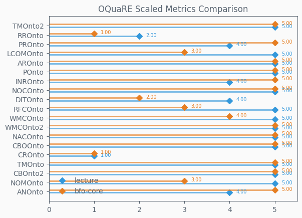

### Raw Metrics

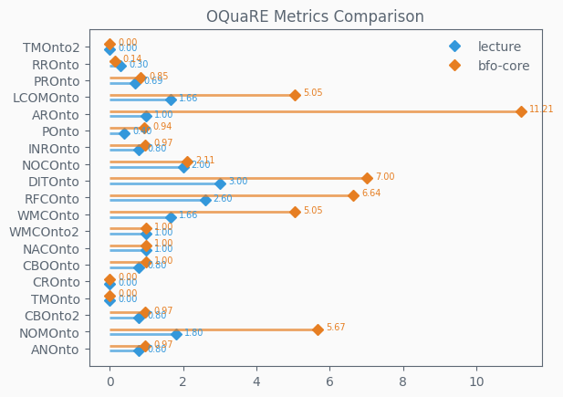

### Metrics Difference

Shows the change in scaled metric values (positive = improvement).

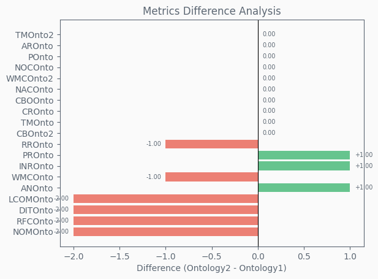

### Metrics Summary Table

| Metric | lecture | bfo-core | Difference | Change % | Status |
|--------|-------|--------|------------|----------|--------|
| ANOnto | 4.00 | 5.00 | +1.00 | +25.00% | ✅ |
| AROnto | 5.00 | 5.00 | 0.00 | 0.00% | ➖ |
| CBOOnto | 5.00 | 5.00 | 0.00 | 0.00% | ➖ |
| CBOnto2 | 5.00 | 5.00 | 0.00 | 0.00% | ➖ |
| CROnto | 1.00 | 1.00 | 0.00 | 0.00% | ➖ |
| DITOnto | 4.00 | 2.00 | -2.00 | -50.00% | ❌ |
| INROnto | 4.00 | 5.00 | +1.00 | +25.00% | ✅ |
| LCOMOnto | 5.00 | 3.00 | -2.00 | -40.00% | ❌ |
| NACOnto | 5.00 | 5.00 | 0.00 | 0.00% | ➖ |
| NOCOnto | 5.00 | 5.00 | 0.00 | 0.00% | ➖ |
| NOMOnto | 5.00 | 3.00 | -2.00 | -40.00% | ❌ |
| POnto | 5.00 | 5.00 | 0.00 | 0.00% | ➖ |
| PROnto | 4.00 | 5.00 | +1.00 | +25.00% | ✅ |
| RFCOnto | 5.00 | 3.00 | -2.00 | -40.00% | ❌ |
| RROnto | 2.00 | 1.00 | -1.00 | -50.00% | ❌ |
| TMOnto | 5.00 | 5.00 | 0.00 | 0.00% | ➖ |
| TMOnto2 | 5.00 | 5.00 | 0.00 | 0.00% | ➖ |
| WMCOnto | 5.00 | 4.00 | -1.00 | -20.00% | ❌ |
| WMCOnto2 | 5.00 | 5.00 | 0.00 | 0.00% | ➖ |

---

## Subcharacteristics Comparison

Detailed comparison of subcharacteristics for each of the 6 main characteristics.

### compatibility
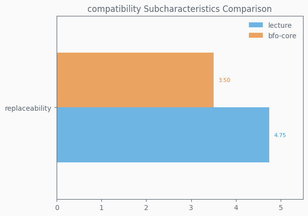

### functionalAdequacy
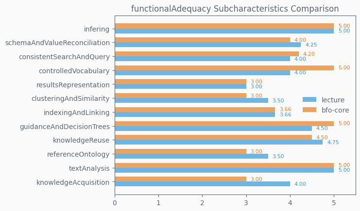

### maintainability
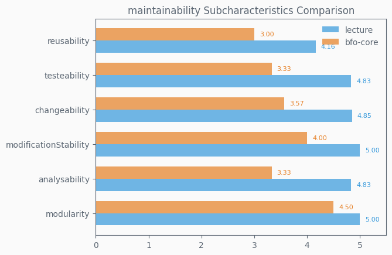

### operability
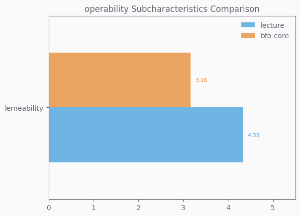

### reliability
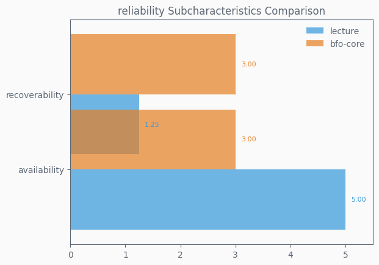

### structural
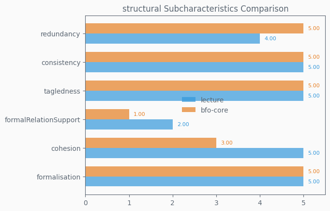

### transferability
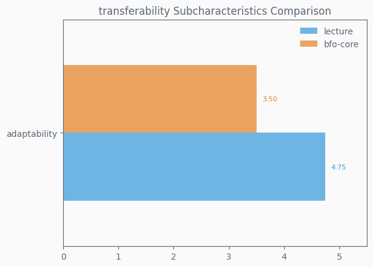

---

## Key Findings

### Top 5 Metric Improvements
1. **ANOnto**: +1.00 (+25.00%)
2. **INROnto**: +1.00 (+25.00%)
3. **PROnto**: +1.00 (+25.00%)

### Top 5 Metric Degradations
1. **NOMOnto**: -2.00 (-40.00%)
2. **RFCOnto**: -2.00 (-40.00%)
3. **DITOnto**: -2.00 (-50.00%)
4. **LCOMOnto**: -2.00 (-40.00%)
5. **WMCOnto**: -1.00 (-20.00%)

---

*Generated by OQuaRE Metrics Comparison Tool*
